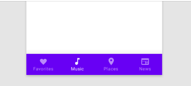
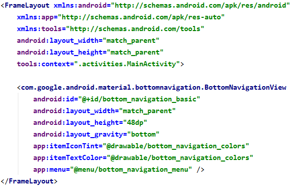
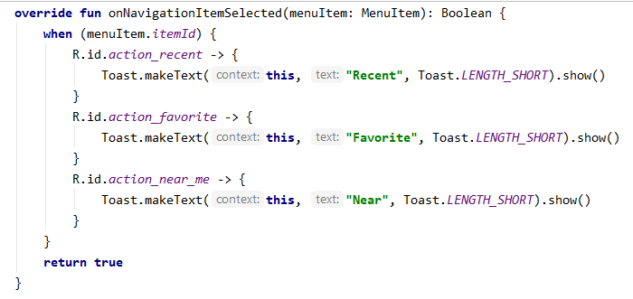
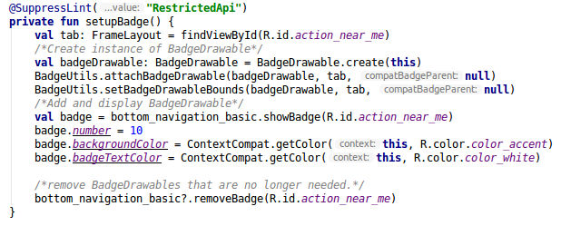
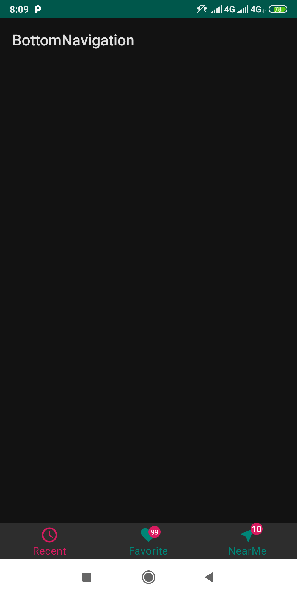

# BottomNavigation
## Overview
- Bottom Navigation cho phép điều hướng các destination trong app. Hiển thị phía dưới màn hình và sử dụng với bottom app bar.

- Sử dụng khi nào:
  	+ Những destination quan trọng cần truy cập từ mọi nơi trong app.
  	+ Có từ 3-5 destination
  	+ Chỉ dành cho mobile và tablet
- Không nên sử dụng khi:
	+ Ít hơn 3 hoặc nhiều hơn 5 destination
 	+ Tùy chọn hoặc settings
- Thận trọng khi sử dụng chung với các tabs có thể gây nhầm lẫn, không rõ ràng. Các tabs thường chia sẻ chủ đề chung còn bottom navigation hoàn toàn trái ngược.
- Cấu trúc:

 	+ Container
	+ Inactive icon
 	+ Inactive text label
 	+ Active icon
 	+ Active text label
  
## BottomNavigation Basic
- Step 1: Tạo BottomNavigationView trong XML

	

- Step 2: Code
	+ Bắt sự kiện click item

	

### Badges với BottomNavigation
- Dùng để hiển thị thông báo động như một số yêu cầu đang chờ xử lý trong BottomNavigationView hoặc TabLayout

- Implement:
	+ Tạo instance của BadgeDrawable.
	+ Thêm và hiển thị BadgeDrawable ở trên cùng của View muốn neo, phụ thuộc vào API (API 18)

	
	
- Kết quả:

## Tham khảo
- Material design:
	+ https://medium.com/over-engineering/hands-on-with-material-components-for-android-bottom-navigation-aae2aa9066be
	+ https://medium.com/over-engineering/setting-up-a-material-components-theme-for-android-fbf7774da739
